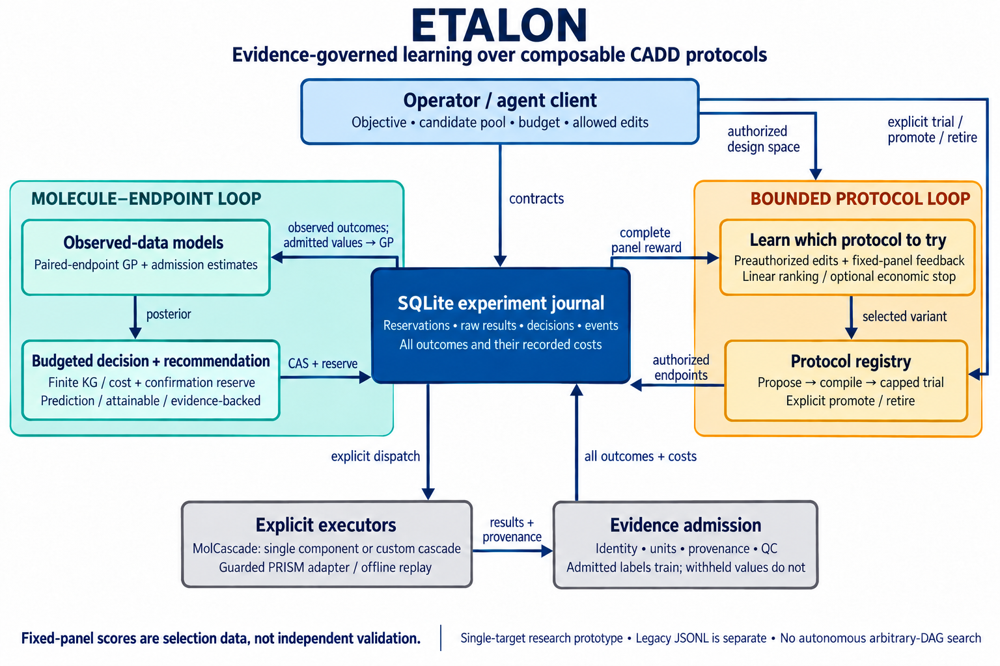
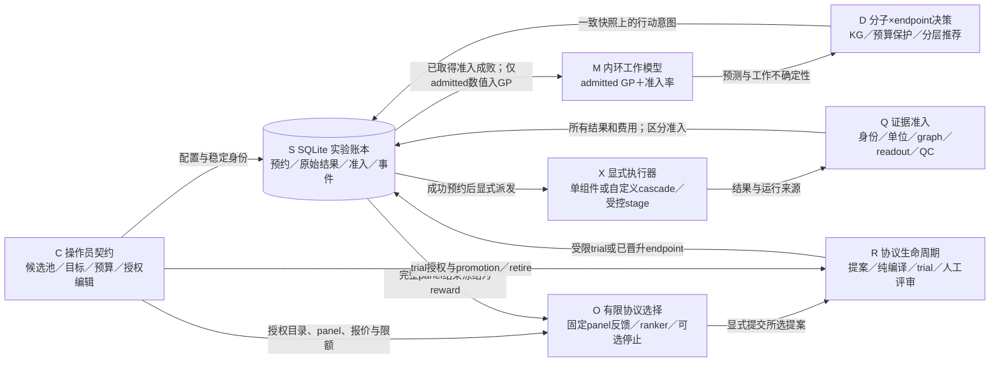

# ETALON 当前架构：两层学习、证据边界与显式执行

2026-09-18 更新：新增独立的 bulk 筛选后台任务入口、环境诊断和 HTTP advisor；GP 查询分块，
模型版本为 `paired-task-gp/4`。下图描述的学习环保持原有边界；新增 bulk 账本尚未与 active 预算合并。
具体变化见 [本轮评估](review-2026-09-18.md) 和 [运行指南](runtime-guide.md)。

本页是 2026-09-17 仓库实现的架构说明与画图规格，不是未来路线图，也不新增运行结果或性能结论。
当前可准确概括为：**单靶点、多 endpoint 的预算化主动学习内环，加上有限预授权协议空间中的反馈选择外环**。
数值策略负责排序；工具执行、质量准入、协议晋升和故障恢复分别有明确边界。

已生成并保存 [PNG 架构图](images/etalon-architecture-2026-09-17.png)（1536 × 1024），
由内置 imagegen 生成并定向修正了显式授权连接。服务没有返回模型标识，PNG 也没有模型元数据，
因此不能确认使用了用户指定的 GPT Image 2.5；详见 [生成记录](images/README.md)。
下面的 Mermaid 保留为可审查的连接规格，不替代模型来源说明。

## 1. 八个已实现模块

| 模块 | 当前职责与主要源码 |
| --- | --- |
| **C：操作员契约与设计输入** | 声明候选身份/特征、单一 target 的 objective、多 endpoint、方向/单位、预算、重复次数与策略；绑定 seed recipe、有限编辑空间、固定审计面板及报价。见 [schema.py](../src/etalon/active/schema.py)、[adapters.py](../src/etalon/active/adapters.py)、[mutations.py](../src/etalon/active/mutations.py)。 |
| **S：持久化实验账本** | SQLite 保存配置、候选、round、action、预约成本、实际费用、原始结果、准入裁决、资源身份及事件；受控协议/搜索状态也存入同一账本。见 [store.py](../src/etalon/active/store.py)、[budget.py](../src/etalon/active/budget.py)。 |
| **M：内环工作模型** | `MultiEndpointGP` 只用 admitted 数值训练，按已有配对分子估计 endpoint 相关性；`admission_estimate` 另从已取得的准入结果估计局部或全局成功概率。见 [model.py](../src/etalon/active/model.py)、[reliability.py](../src/etalon/active/reliability.py)。 |
| **D：预算决策与推荐** | 选择候选分子及 endpoint，受重复次数、handoff、协议/panel 配额及预算约束；支持有限全局 KG、显式 calibration/confirmation 启发式及旧基线。另区分 provisional、attainable、evidence-backed 推荐。见 [decision.py](../src/etalon/active/decision.py)、[knowledge.py](../src/etalon/active/knowledge.py)、[policy.py](../src/etalon/active/policy.py)、[recommendation.py](../src/etalon/active/recommendation.py)。 |
| **X：显式执行与基础设施适配** | `ActiveCampaign` 需显式注入 executor；`CascadeExecutor` 执行已绑定 recipe，`StageExecutor` 桥接已授权昂贵阶段，`ReplayExecutor` 只查离线表。见 [runner.py](../src/etalon/active/runner.py)、[cascade.py](../src/etalon/active/cascade.py)、[adapters.py](../src/etalon/active/adapters.py)、[replay.py](../src/etalon/active/replay.py)。 |
| **Q：身份、协议与质量准入** | 检查结果的 molecule/endpoint/单位、执行完整性、化学状态及受控 graph/readout 证据；结合 fault 与具名 waiver 裁决是否可训练。失败与 withheld 仍保留原始记录及费用。见 [graph.py](../src/etalon/active/graph.py)、[protocols.py](../src/etalon/active/protocols.py)、[admissible.py](../src/etalon/learn/admissible.py)、[attribution.py](../src/etalon/faults/attribution.py)、[waiver.py](../src/etalon/judgment/waiver.py)。 |
| **O：有限外层反馈选择** | `ProtocolSearch` 枚举预授权编辑组合，使用完整固定面板试验的冻结 `panel_skill` 学习下一 variant 排序；可显式选择经济停止规则 `audit_ei`。见 [proposer.py](../src/etalon/active/proposer.py)、[protocol_score.py](../src/etalon/active/protocol_score.py)。 |
| **R：协议生命周期与人工评审** | `ProtocolRegistry` 保存 proposal，纯编译验证，显式启动限额 trial，检查预声明运行准入条件，再由操作者显式 promote/retire。编译、执行、评分和晋升不是同一个动作。见 [protocols.py](../src/etalon/active/protocols.py)、[graph.py](../src/etalon/active/graph.py)。 |

表中的模块是职责分组，不意味着八个独立服务或八个自主 LLM agent。
例如 Q 的检查分布在 executor、协议注册表与账本提交边界，而不是一个可以绕过其他检查的单独开关。

## 2. 可审查的图规格

图中反馈箭头表示实际 API 的数据依赖，**不是所有箭头都会由程序自动连续调用**。
`plan()` 不会预约或执行；协议排序也不会自动启动 trial 或 promotion。
外层试验同样经过 S → X → Q → S 的预约、执行和记录路径，不能画一条绕过账本的 O → 工具捷径。

绘制正式图片时，建议将 S/M/D/X/Q 作为主环，将 C/O/R 放在其上方。
人工授权、waiver、晋升/退役使用明确的“人工/显式 API”标注；不要用绿色勾号把结构编译画成科学验证。

## 3. 主环：每一步究竟依赖什么

`ActiveCampaign.plan()` 从一次账本快照读取候选、observations、actions、预算与协议限制。
模型训练不读取未取得 oracle 标签；未准入数值不进入 GP。
准入率模型使用已发生的 admission 成败，而不把被拒绝的数值当作目标标签；blocked preflight 不被当成化学失败。

决策的真实语义是 `(candidate_id, endpoint_id, replicate)`，不是默认 cascade 的“下一层”。
不同 endpoint 保留自己的 quantity、units、direction、protocol、噪声与成本声明。
当前 campaign 只建模一个 target；多个 endpoint 不等于已经实现跨靶点迁移学习。

`mf_kg` 与 `decision_aware` 每轮只返回一个动作，随后必须看到真实反馈再决策。
其他历史策略仍可构造 batch；不能把整个工程都描述成严格单动作、或者声称所有 batch 做了联合 Bayesian 优化。
KG 是既有的一步实验设计方法，确认预算与 calibration 配额是显式启发式，不是有限预算最优性证明。

执行前，runner 用 planning event cutoff 检查该意图是否仍对应当前账本，再启动 round 和预约 action。
预约环节继续检查配额、重复次数与预算。需要 handoff 的 endpoint 还要通过实际授权检查。
创建 campaign、计算模型、查看 plan 都不自动启动昂贵工具。

返回结果可能是成功、失败、invalid 或 blocked。实际费用按结果记录；缺少可用费用的执行异常可按 reservation 保守记账，
并明确标出 actual cost unavailable。报价不是运行耗时上界，真实费用超过报价仍可能导致 overspend；历史费用不会因此被重写。

推荐输出分别表示：

- `provisional`：后验均值最好的预测，可能没有 objective 证据，也可能无法立即确认。
- `attainable`：已有 objective 证据，或当前预算与资格允许再确认；仍不保证 preflight、工具成功或科学准确。
- `evidence_backed`：确有 admitted objective 协议结果的候选，**不等于实验验证活性或无噪声最优分子**。

## 4. 外环：学的是有限编辑选择，不是任意程序

外层先绑定 seed recipe 和 `DesignSpace`，枚举规范顺序的允许编辑组合。
只有显式报价、编译可接受、未重复的 variant 可进入授权目录；超出枚举上限会拒绝，不悄悄筛选有利候选。
当前 ranker 特征是协议编辑 token 与截距，尚未加入分子/靶点/错误类别的上下文交互模型。

`authorize()` 固定审计 panel、已有 objective 证据身份、variant 特征、报价、总预算、最大 trial 数以及评分/排序契约。
panel 要求每个分子恰有一条 admitted 的实际 round objective 结果；imports 不能替代该运行证据。
这里的 objective 可以是算得的 descriptor 或协议读数，不能在图中一律标为“实验 IC50 真值”。

`plan()` 给出排序和 snapshot hash；`propose_next()` 验证该快照并持久化意图。
`validate()` 只编译，`start_trial()` 需要显式限额授权，`run_audit()` 在冻结 panel 上逐项尝试，`score()` 等完整面板后冻结反馈。
失败尝试仍计成本/试验数，缺失结果不能从分母中删除，也不能把未完成的成功子集冒充整个 panel。

`panel_skill` 的留一拟合排除当前留出行的 objective 标签，衡量协议读数对该 panel objective 的预测用途。
但反复使用同一 panel 来挑选 variant 后，它就是**外层训练/选择面板**，不是独立终局验证集。
共享线性模型、UCB、留一评分、EI 与成本换算均不是 ETALON 首创算法。

可选 `audit_ei` 需要操作者显式指定正的 `opportunity_cost`：panel-skill 点数/成本单位。
它比较下一次完整面板试验的工作模型预期增益与该报价的机会代价；零外部选项只代表停止新增搜索。
这个零不代表 seed protocol 的实测 skill，经济停止也不证明剩余协议都无价值。
未试验协议不会仅凭预测被推荐上线；`promote()` 仍需显式评审，并通过运行准入条件。
通过这些条件也只表示 operational rollout 门槛，不构成独立科学优效性或故障修复因果证明。

## 5. MolCascade 是组件底座，不是强制漏斗

[campaign/design.py](../src/etalon/campaign/design.py) 提供 `component()`、`compose()` 与 `catalogue()`。
单个科学组件可以构成独立 recipe；也可以显式组合多个组件、顺序、并行汇合、gate 和 evidence binding。
除必要输入/登记设置外，不会因某个默认示例有多层筛选，就自动补回那些科学层级。

组合仍必须满足 MolCascade 的类型、契约、数据依赖及前置条件；“可单独使用”不等于任意插件都不需要输入依赖。
`CascadeRecipe` 冻结配置、readout、基础设施身份及声明文件；运行时再把模板图与实际输入绑定的执行计划对应起来。
内环把一个 recipe 当作有身份的 endpoint，不会对其内部每个 DAG 节点自动分配 Bayesian 查询。
外环只重组预授权编辑；这与开放式任意 DAG 搜索或自主生成科学程序有本质区别。

必须分清三种不同的证据：

1. **结构编译证据**：recipe 的图、输入输出契约及 readout 声明可成立。
2. **运行溯源证据**：本次 action 的输入、身份、完整执行状态与 readout 来源对应得上。
3. **科学有效性证据**：读数能否预测真实药理、能否跨分布泛化；前两项不自动提供这一项。

## 6. LLM、CLI、MCP 与两套账本的边界

LLM 可以作为上层操作者理解需求、解释证据、组织显式调用，但当前数值排序由 Python 策略完成。
不应在图中把 LLM 画成已经训练好的端到端 CADD 优化器，也不能让它的文字判断替代准入证据。

[active/cli.py](../src/etalon/active/cli.py) 的 status、plan、recommend、export、protocols、searches 使用只读 campaign 入口；
离线 replay 与合成 benchmark 是显式写入/计算入口，不自动接通 live docking 或 MD。
[mcp/active.py](../src/etalon/mcp/active.py) 提供只读 status/plan 与有轮数上限的离线 replay。
这描述的是新增 active 接口；其他既有 MCP 模块另有自己的工具与权限，不能据此声称整个 MCP 服务器只有三项能力。
每次 plan/recommend 各自读取一致快照；组合 `inspect()` 以及 CLI/MCP 的 active plan
只读一次状态并拟合一次模型，计划与推荐共享 event cutoff。独立发出的多次 API 调用仍可能看到不同提交。

新主环使用 [active/store.py](../src/etalon/active/store.py) 的 SQLite 状态机。
旧 campaign 配置评估/回退路径使用 [campaign/ledger.py](../src/etalon/campaign/ledger.py) 的 JSONL；
两者没有被统一成一套自动迁移或共享预算的账本，不能在架构图中不加说明地合并。
旧 JSONL 用合作式 POSIX 文件锁保护读写，竞争明确拒绝；这不是对不合作外部编辑的防篡改保证。

崩溃后 pending action 的预约不会自动清零，工具也不会自动重试。
`recover_idle_rounds(reason=...)` 只恢复无 pending action 的闲置 round；已启动工具的真实结果与费用仍需明确处理。
waiver、trial 授权、promotion 与 retire 都应画成有理由、有记录的显式控制点，而非模型预测的自动副作用。
这里的“人工评审”描述使用流程，不是已经实现的人类身份认证系统：拥有 Python API 访问权的调用者
仍可主动调用带 rationale 的 trial/promotion 方法。正式部署须在外层落实调用者认证和权限隔离；
不能把当前本地 API 或具名 waiver 字段画成不可绕过的人类专属安全边界。

## 7. 图中不得暗示的已完成能力

- 任意 DAG 自动学习、自动选择所有科学前置条件，或通用自动故障修复策略。
- 跨靶点泛化、独立实验验证、自动可部署协议推荐或已证明的真实 CADD 命中率提升。
- 用 compile 成功、图身份一致、posterior SD 或 economic stop 替代科学可靠性证明。
- 使用未查询 oracle 训练；纯合成奖励冒充运行证据；CPU descriptor 示例冒充完整 prospective CADD 实验。
- 所有成本都已经实测为 GPU 小时/实验货币，或者 reservation 能保证绝不超支。
- 现有源码指纹等于完整可复现实验环境锁、外部资产不可篡改证明或统计显著性证据。

进一步的接口使用与方法限制分别见 [active-learning.md](active-learning.md)、
[protocol-learning.md](protocol-learning.md)、[protocol-search.md](protocol-search.md) 与 [protocol-stopping.md](protocol-stopping.md)。
