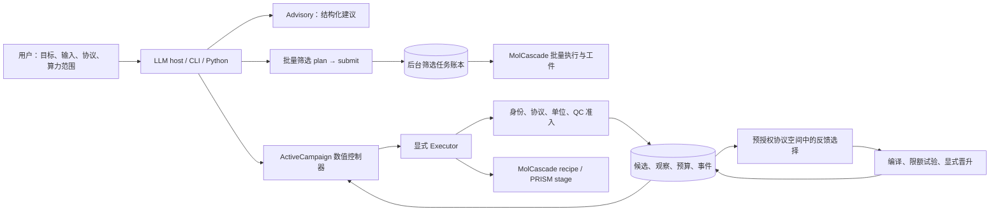

# ETALON 架构、可运行性与 agent 对比评估

审查日期：2026-09-18。对象是当前工作目录的实际源码，包含开始前已有的未提交修改。
方法是源码追踪、独立环境的回归测试、真实 MolCascade CPU 计算、真实 MCP stdio 通信，
以及官方项目文档和原始论文比较。没有用其他项目的宣传指标做 ETALON 的性能证据。

**判断：ETALON 已经是有实质科学约束的 CADD 工作流与主动学习原型，具有工程特色；
但目前不能称为接入任意 LLM 后，就无需操作员干预地完成高通量 docking → MD → MM/PBSA → PMF/FEP 的生产系统。**
本次升级改善环境定位、真实筛选入口、长任务与 LLM 接入；后文明确区分修改前状态、已完成升级和待实现能力。

## 1. 架构与创新性

核心不是一个大 prompt。主干为三层：

- **科学执行层**：MolCascade 编译组件/任意合法 cascade，保存 typed、content-addressed 工件；
  PRISM 提供系统构建和 MD/自由能相关程序。ETALON 用边界适配器识别所加载的 asset，隔离运行环境。
- **确定性控制层**：候选与 endpoint 身份、QC 准入、预算预约、SQLite 事件和原始结果；
  数值模型依据 admitted 观察选择下一 `(molecule, endpoint, replicate)`。
- **建议与交互层**：CLI、MCP、LLM advisor/council。建议仍须经过实际身份、预算和质量检查。
  两层学习分别是分子/endpoint 查询和有限协议编辑搜索；不是多个 LLM 角色聊天就产生学习。

图中 bulk job 与 active campaign 是不同账本；当前没有从 bulk 工件到已记账观察的自动箭头。
LLM 不是 GP、模拟器或成本计量器。旧 `campaign/ledger.py` 的 JSONL 也仍存在，尚未合并到新账本。

**值得保留的特色**：化学状态/结构交接检查直接约束是否可以花费算力；反馈标签有协议身份，
失效计算不作为训练样本；修改协议后保留旧标签和出处；拒绝、失败与费用均可追踪。
这是比“调用工具并总结返回文本”更有实质内容的领域设计。

**创新边界**：工具使用、DAG、模型委员会、主动学习、RF、GP、KG、UCB、EI、留一评分、
以及用昂贵计算反馈便宜筛选，均有明确先例。ETALON 可研究的贡献是
“质量准入与身份约束能否在相同预算下，减少错误标签传播并改善最终决策”。
目前的测试证明工程行为，不能证明算法首创、科学收益或优于已发表系统。
[IMPECCABLE 原始工作](https://discovery.ucl.ac.uk/id/eprint/10140536/) 已把学习与物理计算整合用于药物发现；
[Colmena 官方文档](https://colmena.readthedocs.io/en/latest/) 已提供 thinker 与计算任务之间的反馈执行模式。

## 2. 能否运行筛选与后续计算

| 能力 | 源码审查与本轮实测结论 |
| --- | --- |
| 物性/结构组件与过滤 | **能运行**。本次真实 CPU bulk 例完成 4 个阶段，5 条输入最终保留 2 条；不是 oracle replay。 |
| 单组件/自定义 cascade 主动学习 | **能运行**。真实组件例完成 8 轮、16 条 admitted 观察，报价预算 24 用尽，无 pending。优化目标是示例物性，不能说筛出了高亲和药物。 |
| 高通量 docking | MolCascade 有批量/分片/后端与资源配置路径；新的入口可以提交配置好的 cascade。本轮没有给定受体、box 和真实靶标库，**未完成实际 docking 验证**。 |
| MD 构建与执行 | `Simulate` 提供子进程、产物/日志校验、进程组和运行锁。部署仍需匹配的 AmberTools/PRISM 环境、有效坐标和科学参数；本轮未跑真实 MD。 |
| MM/PBSA | `PrismStage` 默认要求校验 em/nvt/npt 产物，实际脚本仍运行 production，再尝试读取 `FINAL_RESULTS_MMPBSA.dat`；该默认路径没有完整启动 MM/PBSA 的执行编排。**读取存在结果不等于执行该方法**。 |
| PMF | PRISM asset 有构建/分析模块；ETALON 尚无贯通 umbrella window 执行、采样诊断、积分约定、误差与训练准入的标准 endpoint。 |
| FEP | 有 MCS/network 设计和 PRISM FEP 能力；网络设计不等于跑完 λ windows。当前单分子 endpoint 明确拒绝直接把 RBFE 当单分子标签，仍需带 reference/edge/covariance 的专门适配。 |

默认 Anaconda 环境：Python 3.11.5、Pydantic 1.10.8、PyArrow 11.0.0，未安装 MCP。
原测试在该环境出现 **43 failed、252 errors、10 skipped、1297 passed**。
在独立兼容环境中，修改前基线 **1602 passed**。因此不能据默认环境的错误认定所有功能失效，
也不能据隔离环境单测通过声称任何机器安装即可运行。

本机能找到 GROMACS 2025.1 和 Claude CLI；指定 `prism` conda 环境的构建工具诊断仍缺
antechamber、parmchk2、acpype、tleap。其他 conda 环境可能持有这些工具，本轮未宣称整个机器均无安装。
doctor 的就绪范围和路径记录见 [验证记录](validation-2026-09-18.md)。

另外确认 `Simulate.drive(stages=...)` 控制的是产物检查清单，不会截短 `localrun.sh`。
此前 `Simulate.build` 未暴露 production 时长，只能沿用 pinned PRISM 的 500 ns 默认值。
本轮新增可显式设置的 `production_ns`，由 `PrismStage` 传到 builder 并记录在 manifest 中；
改变时长后不能复用旧协议构建。这没有把“只检查平衡阶段”变为“只运行平衡阶段”，也不代替采样设计。

## 3. 与常见 agent 框架和直接相关系统对比

这里选取通用主流框架、公开的药物/MD agent 和学习型计算工作流作代表性比较，
不是市场份额排名。不同类别不应按一个“工具数”或异构 benchmark 分数排序。
下列能力来自项目公开资料，未在本机逐个部署复现。

| 对象 | 官方资料描述的重心 | 对 ETALON 的启示与判断 |
| --- | --- | --- |
| [LangGraph](https://docs.langchain.com/oss/python/langgraph/persistence) | 图状态、checkpoint/store、跨轮持续状态和中断恢复 | ETALON 已有科学账本，但还缺统一任务调度/恢复。可把成熟编排层置于外部，保留内部科学准入。通用 checkpoint 不验证分子或物理结果。 |
| [OpenAI Agents SDK](https://developers.openai.com/api/docs/guides/agents) | 应用内 agent loop、tools、handoffs；部署和存储由应用掌握 | 适合补对话与工具循环；不能代替 MD/FEP 执行器。ETALON 的 MCP 是接入点，HTTP advisor 不是完整 SDK runner。 |
| [AutoGen AgentChat](https://microsoft.github.io/autogen/stable/user-guide/agentchat-user-guide/index.html) | agents/teams、事件驱动核心、状态、termination、工作流与可观测性 | 多角色协调更成熟；增加角色不是 ETALON 当前最紧迫的问题，先保证实际计算闭环更有价值。 |
| [CrewAI Flows](https://docs.crewai.com/en/concepts/flows) | flow 状态、事件路由、持久化与恢复 | 可借鉴稳定业务流程的易用入口和状态展示；科学标签与成本语义仍由 ETALON 提供。 |
| [ChemCrow](https://www.nature.com/articles/s42256-024-00832-8) / [Coscientist](https://www.nature.com/articles/s41586-023-06792-0) | LLM 使用领域工具；后者覆盖实验设计、文档/网络检索与实验自动化 | 已说明“LLM + 化学工具”并非新概念。其任务与 ETALON 的预算化筛选不同，不能凭各自案例推断谁筛选更好。 |
| [MDCrow](https://github.com/ur-whitelab/MDCrow) | LangChain 工具驱动的 MD，主要使用 OpenMM/MDTraj | 与 MD 自动执行更直接相关；ETALON 的范围扩展到筛选和反馈，但当前易用执行面仍需补齐。 |
| [DynaMate](https://github.com/schwallergroup/DynaMate) | LiteLLM、GROMACS/AMBER、蛋白配体 MD、MM/PB(GB)SA、质量检查与重试 | 这是比通用聊天 agent 更贴近的运行体验参照。它的公开实现提供了 ETALON 可借鉴的完整 MD 工具链；不能把自动重试等同于科学协议可任意改变。 |
| [DrugAgent：ML 编程系统](https://arxiv.org/abs/2411.15692) / [DrugPilot](https://github.com/wzn99/DrugPilot) | 前者以 Planner/Instructor 自动化 ML 实验，后者强调 ReAct、参数记忆和药物工具调用 | 关注任务推理和领域接口。文献中多个项目同名 DrugAgent，本报告只比较链接指定的实现，不混用其结论。 |
| [Colmena](https://colmena.readthedocs.io/en/latest/) / [IMPECCABLE](https://discovery.ucl.ac.uk/id/eprint/10140536/) | HPC/异步模拟反馈、ML 与物理计算的集成 | 是 ETALON 主动学习与规模化更重要的先例。大库吞吐、异步计算和失败成本的实测是下一步关键。 |
| [REINVENT 4](https://link.springer.com/article/10.1186/s13321-024-00812-5) | 在多目标 scoring function 下进行生成式分子设计、RL/TL/curriculum learning | 属于真正的分子生成训练框架。ETALON 可以提供经 QC 的评分后端，但目前不具备同类 RL 训练环。 |

这些资料支持架构层面的比较，不支持对 ETALON 作“优于市场主流”的定量结论。
尤其 DynaMate/MDCrow 更接近 MD 助手，Colmena/IMPECCABLE 更接近计算学习控制器，
LangGraph 等则是通用基础设施，三者不能混为一个竞品类别。

## 4. 接入 LLM 后的流畅性与干预需求

修改前，内部 advisor 只有 Claude CLI 和测试用 `Scripted`，没有标准 GPT/DeepSeek/Anthropic HTTP 适配。
MCP 有计划和质量检查，但 active 接口只提供 status/plan/offline replay，没有真实 bulk 提交面。
用户需要拼接 Python API 和不同执行环境；仅提供一个 API key 无法解决这些缺口。

本轮新增三家 HTTP advisor、环境诊断和 plan → submit → status 工具，
后台计算不依赖 LLM 保持一个长时间未结束的工具调用。真实 MCP SDK 通信已验证。
**这使已有授权范围内的批量筛选可以由 host 连续驱动，尚不意味着存在新的端到端自然语言自治 agent。**
数值学习与科学执行不必每个分子请求 LLM，这对成本、复现和可靠性更合适。

可自动处理的是已有配置下的筛选执行、任务查询、已约定预算下的 AL 查询、明确的输出结构校验，
以及有限次数的暂时性 API 错误重试。仍需操作者设定目标/评价标签、受体/结合位点、化学状态、
计算协议和算力范围；非预授权协议晋升、科学 waiver 与失联昂贵任务恢复也不应由 LLM 随意猜测。
当前具名审批字段不是完整身份认证系统；生产权限要由部署层落实。

三家 API 测试使用 HTTP mock，且本机没有对应 API key，因此**真实模型的成功率、延迟、
长任务自主完成率尚未测定**。这些指标需要固定任务集、多模型、重复运行和干预次数记录。
接入语法与实际模型表现应分别验收。

## 5. 主动学习和 RL 是否自然嵌入

主动学习已经自然嵌入：`ActiveCampaign` 从一致快照拟合模型，预约动作，执行显式 executor，
保存全部结果和费用，仅以 admitted 数值训练下一轮。真实组件示例证明这不是纯合成演示。
有限协议搜索也有持久化空间、冻结面板、配额和反馈，结构上连贯。

但有以下方法边界需要实验验证或工程补齐：

1. **小池模型与大库执行必须分层**。默认精确 GP 上限为 1500 条观察/5000 个候选；
   KG 候选上限为 512。Cholesky 训练仍为立方级，`CascadeExecutor` 每 action 单分子运行，
   不能据 MolCascade 支持大库就说 active 控制器也能直接操作百万候选。
2. **不确定性不是已校准误差条**。跨 endpoint 相关性来自配对观察及收缩；少量配对、
   自适应选择、不同分子区域的失配都会影响其可靠性。需要 scaffold/时间/外靶点留出测试。
3. **QC 选择会改变训练人群**。拒绝坏标签是正确边界，但缺失通常不是随机的。
   现有 admission probability 启发式不是消除选择偏差的证明，不能仅报告成功者的准确率。
4. **协议面板反复使用后就是训练/选择集**。内部留一仍不能成为协议搜索后的独立最终检验。
   应预先锁定终局分子/靶点，比较固定协议、随机搜索、简单 AL 和新策略，并计入失败与规划成本。
5. **昂贵科学读数必须有本身的契约**。MD 稳定性不能直接叫 binding affinity；
   MM/PBSA 需要独立副本和采样/误差定义；PMF 要求窗口重叠与积分约定；
   FEP 的 ΔΔG 有参考边和相关误差，不能简单复用单分子标量语义。PMF 的重叠、相关时间和
   bootstrap 误差限制可对照 [GROMACS WHAM 文档](https://manual.gromacs.org/current/onlinehelp/gmx-wham.html)。
6. **预算目前是报价预约**。真实费用可超过报价，不能宣称严格墙钟/GPU-hours 上界；
   本轮新增 bulk job 也没有偷偷并入该预算。之后需要资源计量与调度器限时。

当前协议 ranker/UCB/EI 属于有限反馈优化，与 contextual bandit/Bayesian search 更接近；
未发现 PPO/策略梯度、可训练生成策略、完整轨迹奖励等 RL 训练链。
如果接 REINVENT 4，可将 ETALON 的有效评分/QC 作为 reward 服务，但需处理延迟奖励、
失败费用、分子身份、重复查询和 reward hacking。对昂贵 FEP 直接在线做大规模 RL，
在有离线数据、可靠 surrogate 和受控验证前，工程与样本效率都不合适。

## 6. 本轮升级与下一步优先级

已完成的增量代码：

| 修改 | 解决的问题 | 主要位置 |
| --- | --- | --- |
| `doctor` CLI/MCP；声明 `mcp`/`llm` extras | 默认环境不兼容时提前说明哪一层不能运行 | [doctor.py](../src/etalon/doctor.py)、[pyproject.toml](../pyproject.toml) |
| 输入绑定的真实 bulk 筛选后台任务 | MCP 只计划、不执行；长调用超时；重复提交风险 | [screening.py](../src/etalon/screening.py)、[MCP execution](../src/etalon/mcp/execution.py) |
| OpenAI/DeepSeek/Anthropic HTTP advisor | 内部建议层只支持 Claude CLI；多家响应契约不同 | [providers.py](../src/etalon/judgment/providers.py) |
| 有限重试和严格 JSON | 暂时性故障直接退出；重复 key、NaN 和 reason 强转可混入建议 | [advisor.py](../src/etalon/judgment/advisor.py) |
| GP 查询分块，模型版本 `/4` | 同时为全部候选分配训练×查询矩阵 | [model.py](../src/etalon/active/model.py) |
| 显式 production 时长及复用身份检查 | 误以为 `stages` 会截短默认 MD；适配器无法声明所需时长 | [simulate.py](../src/etalon/boundary/simulate.py)、[PrismStage](../src/etalon/campaign/expensive.py) |
| wheel 包含 workflow 文本；infra JSON 退出码修复 | 安装后 MCP 资源缺失；机器调用误把失败当成功 | [server.py](../src/etalon/mcp/server.py)、[CLI](../src/etalon/__main__.py) |
| 真实 CPU 过滤示例、真实 stdio 与并发提交测试 | 只有 API 外观而没有真实调用链验证 | [bulk_screen.py](../examples/bulk_screen.py)、[tests](../tests/test_screening_service.py) |

本轮没有修改两个 pinned asset、强行安装到全局环境，或把此前未提交改动回退。
使用方式见 [运行指南](runtime-guide.md)，测试及原件路径见 [验证记录](validation-2026-09-18.md)。

后续建议的实施顺序与验收目标：

| 优先级 | 工作 | 可验收结果 |
| --- | --- | --- |
| P1 | 独立 PRISM 协议执行器：production、MM/PBSA、PMF、FEP 分开声明 | 至少一个指定蛋白/配体体系完整跑通；缺产物或不收敛不能入训练；副本与 seed 独立 |
| P1 | 共用任务契约、资源计量、SLURM/本地 worker 心跳和显式恢复 | 客户端断开、worker 崩溃和队列重启不重复收费；超时子进程可追踪；费用不跨账本丢失 |
| P1 | 独立靶点数据上的等预算对照 | 固定协议/随机/UCB/KG/质量策略公平比较；报告 EF/recall、失败成本、置信区间和人工干预次数 |
| P2 | 批量 active executor、可替换 RF/稀疏 GP 模型与缓存 | 公开池规模、标签数、吞吐、峰值内存、规划耗时；保持完整候选/协议身份 |
| P2 | 统一部署环境和用户操作面 | 文档给出可复建环境，用户可查看输入、运行、失败原因、待决事项和工件 |
| P3 | 需要时引入生成式 RL | 固定 reward 定义、oracle 调用预算和外部验证，证明相对 AL/优化基线的实际收益 |

最有价值的下一项投入是带可靠结果准入的真实 MD/自由能闭环与公平验证。
