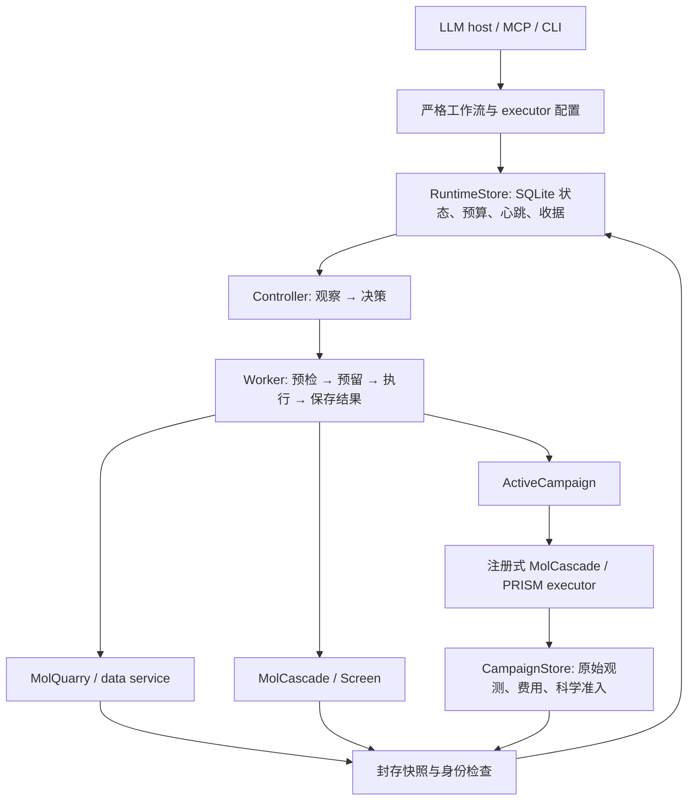

# ETALON 持久 CADD 执行层

本模块把 MolQuarry、MolCascade 和 PRISM 接入同一任务生命周期：规划、提交、查询、取消、对账、读取产物，以及基于产物决定下一步。现有数据封存、分子身份、协议注册、受体绑定、科学准入和主动学习账本继续负责各自的事实。MCP 资源 `etalon://runtime` 提供本文；CLI 与 MCP 使用同一 Python 服务。

[三模块审阅与改进](SCREENING_REVIEW.md) 记录新增搜索 skills、默认 dock–redock RMSD < 2.0 Å 策略、最终人口准入修复，以及文献依据和待验证的创新方向。redock 一致性不能等同于实验姿态准确性或结合活性；已有自定义筛选配置需要显式选择该组件。

## 架构与职责



| 层 | 实现 | 负责什么 |
|---|---|---|
| 严格协议 | `schema.py` | 固定操作名、参数、有限资源、DAG、输出引用、输入摘要 |
| 持久执行 | `service.py`, `store.py`, `worker.py`, `process.py` | 唯一 job、worker 身份、epoch、文件锁、心跳、恢复位置和结果收据 |
| 科学操作 | `operations.py` | 调用现有 data/screen/active 服务；分别检查实际产物与账本 |
| 实验执行器 | `executors.py` | 预生成并注册不可变配置；复用 ProtocolRegistry、MolCascadeExecutor、PrismStage |
| 控制循环 | `controller.py` | 从已验证状态生成观察，检查模型提议，只选择已声明的可执行节点 |
| 产物 | `artifacts.py` | 内容寻址的筛选配置、有界 JSON/快照/筛选结果读取 |
| 接入 | `api.py`, `cli.py`, `../mcp/runtime.py` | 统一服务及现有 active campaign 的单节点便利接口 |

`<workspace>/etalon-runtime.sqlite` 保存 jobs、nodes、receipts 和 events。每个 job 的步骤位于 `jobs/<job_id>/steps/<node_id>`，worker 日志为 `jobs/<job_id>/worker-<epoch>.log`。分子和实验事实保存在原有 campaign SQLite 中；任务服务把费用与任务阶段关联，不另建一套科学准入规则。

## 安装与真实 CPU 示例

当前 detached worker 使用 Linux `/proc`、POSIX 文件锁和进程会话，适用于 Linux/WSL。它是本机任务服务，尚无 Slurm、容器集群或远程执行器后端。使用独立 Python 3.11+ 环境，在完整 checkout 根目录运行：

```bash
pip install -e '.[cascade,quarry,active,mcp]'
python examples/durable_campaign.py --workspace /absolute/new/runtime-demo
python -m etalon workflow status --workspace /absolute/new/runtime-demo --job-id database-campaign
python -m etalon workflow artifact --workspace /absolute/new/runtime-demo --job-id database-campaign \
  --node-id learn --kind result --member /observations --limit 10
```

示例依次完成本地目录获取、标准化、真实 RDKit 属性筛选、SDF 导出、campaign 创建与导入、三轮在线主动学习和离线 sourcing。输入明确标成测试数据，HTTP 次数为零；分子量观测仅验证软件链路，不能作为亲和力或药效证据。完整可修改的图见 `examples/durable_campaign.py`，运行时写出 `workflow.json`。

## 工作流与注册式 executor

工作流顶层必需 `schema="etalon-workflow/1"`、`objective`、`nodes`、`limits`；可选 `controller`、`max_seconds`。每个 node 必需 `id`、`operation`、`arguments`；可选 `depends_on`、`resources`。使用 1–100 个节点；ID 为 1–80 个字母、数字、下划线或连字符，不使用保留名 `pause`/`finish`。

在任意参数中使用 `{"$ref":"library.snapshot"}` 引用前一步输出；引用自动形成依赖。节点的某个输出可继续引用嵌套对象字段。不能引用未验证节点，不能产生环，不能提交任意 shell/Python 命令。所有 API/MCP 路径必须绝对化；CLI 顶层路径会转成绝对路径，JSON 内路径仍需调用者明确提供。

| operation | 必需参数 | 可选参数 / 产物 |
|---|---|---|
| `data.acquire` | `request`, `budget` | `allow_partial`, `min_records`；返回 sealed `snapshot` |
| `data.prepare` | `snapshot` | `id_field`, `smiles_field`, `identity_policy`, `allow_partial`, `min_records`；返回 `snapshot`, `library_path` |
| `screen.run` | `config_path`, `library_path` | `workers`, `devices`, `allow_copyleft`；返回 `workspace`, `run_id`, `run` |
| `screen.export` | `workspace`, `run_id` | 返回 shortlist `path`, `sha256` |
| `campaign.create` | `spec`, `endpoints`, `executors` | 使用原有 CampaignSpec/Endpoint；返回 `database` |
| `campaign.import` | `database`, `snapshot` | 可用 `candidate_ids` 选择候选子集 |
| `campaign.assays` | `database`, `snapshot`, `review` | 复用已审阅 assay 导入与来源绑定 |
| `campaign.handoffs` | `database`, `workspace`, `artifact_id`, `rationale` | 可选 `candidate_ids`；只绑定已验证 handoff |
| `active.run` | `database`, `max_rounds` | `min_new_admitted` 默认 1；返回观测、准入数、费用与 action 身份 |

`data.acquire` 复用现有请求协议，覆盖查询、目标证据、目录导入/搜索、下载、结构 bundle、sourcing。`needs_target_resolution` 等状态不能被当作完整获取；允许 partial 必须明示，且不能免除目标身份或科学审阅。标准化默认至少需要一条候选，active 默认至少需要一条新准入观测。

Executor 采用 `etalon-executor/1`，仅提供 `molcascade` 和 `prism` 两种实现。先 prepare 得到不可变配置、协议与 endpoint，再用返回的 endpoint 创建 campaign。已有 campaign 使用 register，要求 endpoint 完全匹配。相同记录重复注册幂等；修改协议需使用新 endpoint。配置摘要绑定科学输入内容及资产身份，派发前再次验证。

| executor | 配置 | 实际范围 |
|---|---|---|
| `molcascade` | `cascade`、`readout`，可选 `files` | readout 明确 `stage_id`、`contract_id`、`value_column`；复用可组合组件协议，无强制默认筛选层级 |
| `prism` | 绝对 `receptor_path`、环境 `python`、`production_ns`；可选 `timeout_per_molecule` | 固定 MM-PBSA、kcal/mol、minimize、受体绑定 handoff、单次 readout |

PRISM 会调用原有构建/模拟路径，需外部 GROMACS/AmberTools 等环境和真实亲和力结果。平衡完成或程序退出码 0 不会生成虚构 binding energy。当前 executor 不覆盖完整 FEP 编排，也不提供多个独立 replica；其统计可靠性仍受现有科学检查约束。MolQuarry 的构象或结构文件不能自动冒充模拟受体坐标系中的 docked pose。

配置生成 `etalon_screen_configure` / `workflow config` 接受完整 `kind=cascade` 配置，或显式 `schema=etalon-cascade-design/1`、`name`、`tiers` 与 compose 选项。调用者选择层级、组件和阈值；服务校验后写入内容寻址文件，不自行猜测科学设计。

## CLI 与 MCP 生命周期

```bash
python -m etalon workflow capabilities
python -m etalon workflow plan --config /absolute/workflow.json --output /absolute/new-plan.json
python -m etalon workflow submit --config /absolute/new-plan.json \
  --workspace /absolute/runtime --job-id campaign-001 --plan-id PLAN_ID_FROM_PREVIOUS_RESULT
python -m etalon workflow observe --workspace /absolute/runtime --job-id campaign-001
python -m etalon workflow cancel --workspace /absolute/runtime --job-id campaign-001 --reason 'Stop this task'
python -m etalon workflow reconcile --workspace /absolute/runtime --job-id campaign-001 --reason 'Inspect stopped worker receipts'
```

`executor prepare --config` 读取包含 `kind`, `configuration`, `endpoint` 的 JSON；`executor register --database --config --rationale` 读取 prepare 输出。`executor list --database` 查看已注册执行器。所有 `--output` 都拒绝覆盖已有文件。

已有 campaign 可使用 `workflow active-plan --database ... --max-rounds N` 与 `workflow active-submit --database ... --workspace ... --job-id ... --plan-id ... --max-rounds N`。它们是同一服务的单节点工作流，保留原有 active policy 的分子选择和科学准入；重复提交不会因旧任务已花费预算而改变其原有预留。

MCP 对应 15 个入口：

- `etalon_workflow_capabilities`、`etalon_screen_configure`。
- `etalon_executor_prepare`、`etalon_executor_register`、`etalon_executor_list`。
- `etalon_workflow_plan`、`etalon_workflow_submit`、`etalon_workflow_status`。
- `etalon_workflow_observe`、`etalon_workflow_advance`、`etalon_workflow_cancel`、`etalon_workflow_reconcile`、`etalon_workflow_artifact`。
- `etalon_active_execution_plan`、`etalon_active_submit`。

同 `job_id` 与同计划返回既有任务；同 ID 不同计划拒绝。`ok=true` 只说明一次 API 调用成功；完整目标成功以 `job.state=succeeded` 为准。只读查询不会创建不存在的 workspace。执行、advance，以及可能恢复执行的 reconcile 都在 MCP 标明可能花费资源。

## 规划 → 执行 → 检查 → 决策

三种模式共用同一校验器：

- `ordered`：按声明顺序选择 ready node，适合已确定的自动流水线，无模型调用。
- `advisor`：使用现有 `Transport` / HTTP advisor，根据持久观察选择下一步。安装 `.[llm]`，按 `judgment/providers.py` 设置 `ETALON_LLM_PROVIDER`、`ETALON_LLM_MODEL` 及相应凭证；可选 `ETALON_LLM_BASE_URL`。任务只保存调用次数，不保存凭证。
- `external`：LLM host 先 observe，再 advance；每次只推进一个选择，适合 MCP 客户端管理规划和检查。

决策只能包含 `observation_id`、`node_id`、`reason`。观察身份绑定完整节点状态与事件序列，即使展示摘要被截短也不丢失绑定。拒绝未知字段、重复 JSON 键、非有限数、未知节点、过期状态、未满足依赖和提前 `finish`。`pause` 停止派发并保留状态。

每步先解析已验证输出引用并预检，原子预留预算，然后执行；原始结果先写不可变收据，再核对实际产物，最后更新节点。active 每个实验结果也先写 receipt，再交原 CampaignStore 判定。读取下游依赖和最终完成前再次核对科学事实。模型既不能覆盖 verifier，也不能将未准入结果改写为成功。

`controller.max_calls` 为 advisor 的持久调用次数上限，默认 100；一次真实 `Transport.ask` 尝试在调用前计数，包括失败调用，不隐式重试。external 模型由宿主管理，runtime 不声称知道宿主的模型费用。`max_seconds` 默认 3600，约束累计 worker 活动时间；停止期间不计入，恢复沿用剩余额度。它不是 GPU 使用计量，心跳受 OS 调度与阻塞影响，也不是硬实时终止保证。

这里实现的是 STELLA 启发的受限控制循环。图和科学契约在提交时固定；模型可以选择 ready node、检查证据或停止，尚不能在运行中创建新工具、任意改图、替换科学阈值或积累自演化模板。科学假设仍需独立验证。

## 费用、取消与恢复

`limits` 和每节点 `resources` 用显式单位分别记账。`data.acquire` 预留完整 `budget.max_requests` / `budget.max_bytes`，单位为 `http_requests` / `http_bytes`，完成后读取密封快照中的实际使用量。`active.run` 预留 campaign 当前剩余额度，单位为 `campaign:<cost_unit>`，并核对真实实验 action charges。筛选必须提供资源报价；其他声明资源按报价记账并标注 basis。报价不等于 GPU-hours 实测，缺失费用不会推断为零，各种单位不相加为一个总价。

worker 通过数据库 epoch 和本机锁取得唯一任务执行权；心跳约每 0.5 秒更新。进程身份含 PID、启动 ticks、boot ID、会话与进程组；支持时取消通过 pidfd 避免 PID 复用。PRISM 子进程在释放启动门闩前保存身份，父进程在这个窗口被杀死不会放行未记录的科学计算。

`cancel` 持久记录请求并通知 worker 停止。正在执行的步骤可能留下 `reconciliation_required`；这表示结果或费用仍待核对，不等于已释放资源。超时也保留不明确支出。MCP 客户端断线不会取消任务；本机或 worker 崩溃也不会凭心跳失效自动启动另一份计算。

`reconcile` 先确认旧 worker、进程组及已记录科学子会话均已停止，再增加 epoch、核对现有收据/封存结果，并按已保存 action 身份幂等提交结果。它不会重跑已经派发的步骤。找不到完整事实则保留 reservation；`resume=true` 仅推进尚未派发的节点，且不能撤销原取消请求或绕过耗尽的时间/模型限额。已取消任务的后续新实验应形成新的明确计划。无常驻自动重启 daemon；调用者或部署层在故障后调用 reconcile。

显式失败结算格式为 `settlements={node_id:{costs:{unit:amount}, reason:..., evidence:...}}`；evidence 必须是该步骤工作目录内已存在的文件。active 还需 `action_costs={action_id:amount}` 覆盖每个未知动作，且总额与已记账费用一致。整批结算先持久化再逐条记账；中途崩溃可以继续。它只产生失败结果，保留证据摘要，并标明费用来自调用者声明，不能输入科学值或取得准入。

不要同时通过另一个直接 runner 修改同一 active campaign。runtime 使用每 campaign 锁协调自己的任务，但不是任意外部程序的分布式锁或通用 exactly-once 服务。科学输入、已封存产物和安装环境在运行/恢复期间应保持稳定；升级代码后的跨版本迁移没有自动兼容承诺。

## 读取与检验产物

`workflow artifact` / `etalon_workflow_artifact` 以 job/node 为范围：`kind=result` 用 JSON Pointer（如 `/observations`）读取结果；`kind=snapshot` 只读密封清单成员；`kind=screen` 只读已记录 artifact ID 与 contract。返回 `offset`, `limit`, `total`, `next_offset`，分页响应有 1 MiB 上限，单个科学记录过大时明确拒绝而不截断其字段。没有通用任意路径文件读取入口。

验证范围见 `tests/test_runtime_*.py`：真实 CPU 数据→筛选→active 链、真实 stdio MCP、注册与协议约束、产物篡改、重复并发提交、模型错误和额度、取消与超时、进程 SIGKILL、陈旧 epoch、结果持久化失败、人工结算中断、未知费用保留。付费在线 LLM、联网数据库账户额度、真实 GPU MD/FEP 与科研有效性不由这些 CPU 工程测试证明。

## 文献依据与采用边界

以下为调研使用的一手论文和官方工程资料，查阅日期 2026-09-22。表中 ETALON 设计是结合既有代码的工程选择，不声称复现论文系统或获得其基准成绩。

| 来源 | 可采用的原则 | 本实现 |
|---|---|---|
| Jin et al., [STELLA: Self-Evolving LLM Agent for Biomedical Research](https://arxiv.org/html/2507.02004v1), 2025, v1 | manager 分解与协调，执行后检查中间结果，再决定后续行动；论文另含模板与工具演化 | `controller.py` 的观察/提议与 `service.py` 的执行/检查分工；先保留固定工具与科学契约 |
| Yao et al., [ReAct: Synergizing Reasoning and Acting in Language Models](https://arxiv.org/abs/2210.03629), ICLR 2023 | 决策与环境动作/观察交替 | typed proposal → registered operation → artifact observation；不使用自由代码作为 action |
| Uhrin et al., [Workflows in AiiDA](https://doi.org/10.1016/j.commatsci.2020.110086), Computational Materials Science 187, 2021；[公开论文](https://arxiv.org/abs/2007.10312) | 显式工作流步骤、持久上下文和科学来源记录 | SQLite 节点状态、输入引用、执行收据与独立 CampaignStore 事实 |
| Shinn et al., [Reflexion](https://arxiv.org/html/2303.11366v4), 2023 | 利用反馈改进后续行为；自评信号质量影响可靠性 | 保存失败与验证反馈；scientific critic 采用代码规则，未加入长期语言记忆系统 |
| [Parsl checkpointing 官方文档](https://parsl.readthedocs.io/en/latest/userguide/workflows/checkpoints.html) | 结果重用与运行去重具有不同边界；缓存需明确函数/输入身份 | 输入内容与执行协议绑定；job 去重使用数据库和 owner 锁 |
| [Temporal activity idempotency](https://docs.temporal.io/activity-definition#idempotency)、[heartbeat](https://docs.temporal.io/encyclopedia/detecting-activity-failures#activity-heartbeat) | 持久控制流不能自动消除外部副作用重复；取消需执行端配合 | 科学 child 身份、持久取消、先对账再恢复、未知支出不归零 |

因此当前 ETALON 的优势是 CADD 专用的证据、身份、预算和恢复约束；相对 STELLA 的通用工具扩展与策略迁移仍有限。下一步扩展远程调度、独立 replica/FEP、实际 GPU 计费或模板学习时，应各自增加操作契约、来源记录和故障验证，继续使用现有科学准入层。
