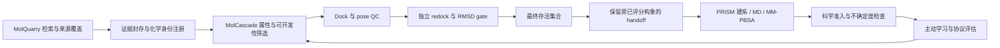

# ETALON 三模块审阅与改进（2026-09-23）

## 已有工作流与本次改动

阅读范围覆盖 ETALON 的数据入口、MolCascade 组件编译和筛选、主动学习准入、PRISM handoff/执行接口，以及当前工作区的持久 runtime。MolQuarry 负责检索与证据，MolCascade 负责化学标准化、筛选和构象，PRISM 负责建系与模拟；ETALON 负责固定协议、串联状态、预算、结果核验与学习。现有 runtime 的恢复、收据和费用保护继续保留。



图中 redock 是 MolCascade 新生成默认筛选模板的一部分。ETALON 的 `compose` 继续支持调用者明确选择的单组件或自定义协议；已有固定 JSON 不会静默改写。MD 与 MM-PBSA 要求实际外部环境和结果，运行退出码不能替代科学读数。

本次落地：

- MolQuarry 新增四个搜索 skills 和 PubChem 子结构查询；原有两个 skills 一并接入 CLI、MCP 与 wheel 分发。ETALON 从同一份上游 skill 索引发现全部工作流和引用，不再维护两个写死的名字。
- MolCascade 默认在 docking 后加入 `redock_consistency` 和严格 RMSD gate，保留原 dock 分数与构象。独立重搜生成的构象、种子、方法、原构象摘要及 RMSD 解释进入证据。
- ETALON 修复后置 gate 准入问题：早期评分存在不再代表完整协议接受该分子。最终 `parent/v1` 人口决定是否准入；被淘汰候选的原始评分仍保存在 provenance，已发生的费用不被抹掉。ANY/ALL 合并遵循实际末端人口。
- ETALON 修复空人口读取：合法的空 `parent/v1` 返回空列表，仅没有该 contract 才抛错。此前混淆两者会使消费者忽略“全部淘汰”。
- `Screen.with_handoff(..., evidence_from=...)` 可以明确绑定已评分构象来源。多生产者时由编译器验证，避免用错 pose。

## MolQuarry 还能做哪些搜索

| Skill | 可执行搜索 | 输出与解释边界 |
|---|---|---|
| `target-modulators`（已有） | 靶点身份、已知调节剂、公开证据与结构 | 收集不等于自动确认抑制机制 |
| `compound-sourcing`（已有） | 本地目录与公开供应商来源 | 目录记录不保证实时库存或合成可行 |
| `analogue-search`（新增） | PubChem/ChEMBL 相似物、PubChem SMILES 子结构命中 | 明确阈值、结构身份与结果上限，不声称穷举或专利新颖性 |
| `selectivity-evidence`（新增） | 同一化合物的靶点、脱靶和 counter-screen 测量 | 区分没有测到、没有查到、未查和失败；可比较测定才计算选择性倍数 |
| `structure-templates`（新增） | RCSB/PDBe 实验结构、配体和链、UniProt 映射、预测结构补充 | 区分实验与预测，保留构建体/突变、口袋、缺失残基及配体坐标信息 |
| `assay-literature`（新增） | ChEMBL/PubChem assay 上下文及 Europe PMC 文献 | 分开 Ki/Kd/IC50/EC50、关系符、物种和实验条件，标题摘要不能填补未读的实验事实 |

ETALON MCP 索引为 `etalon://skills/molquarry`；单项保持 `etalon://skills/molquarry/<slug>`。使用 ETALON 的 `data plan/run/prepare` 封存数据，经过显式 assay review 才能把适用的历史实验值送入训练。原生 MolQuarry CLI 使用 `molquarry skills` 和 `molquarry skill molquarry-analogue-search`。

## Redock 的接受标准与适用范围

默认接受 **固定受体坐标系内、对称性校正的重原子 RMSD < 2.0 Å**。正好 2.0 Å 被拒绝；缺失构象、非有限数、化学身份不一致、原子映射失败、超过对称映射搜索上限或计算失败均不能通过。

实现比较原先保留的 rank-0 dock pose 与独立搜索的 rank-0 pose。重搜先检查原 pose 与 parent 的连接关系、明确手性及化学状态一致，再提取原 pose 已确定的异构 SMILES，丢弃其坐标后重新生成 ETKDG 输入，使用不同随机种子；不把 dock pose 直接当 redock 初始构象，不在 RMSD 前独立平移或旋转配体，不从多个结果中挑最相似的一对。受体、准备后受体、原对接设置与方法身份必须一致。当前实现是 Uni-Dock 复核；自定义其他引擎需相应适配，不能自动宣称已做同种验证。

原始已评分 dock pose 继续用于导出和 handoff；redock 是一致性证据与筛选。这样不产生“dock 分数属于 A 构象，MD 却从 B 构象开始”的隐式替换。这种做法也避免未指定手性输入在重新嵌入时变成另一个立体异构体。默认保留已有 pose QC；一致性不能替代键长、立体化学、环平面性和蛋白碰撞检查。

**文献事实与本项目选择要分开。** 2 Å 常见于预测 pose 与实验晶体 pose 的比较；将它用于 dock–redock 重复性，是本项目可配置、需按靶点校准的工程默认，不是文献证明的亲和力或 pose 正确性标准。两个相同方法可能稳定地产生同一个错误 pose。[PoseBusters](https://doi.org/10.1039/D3SC04185A)展示了仅靠 RMSD 的局限；[DockRMSD](https://doi.org/10.1186/s13321-019-0362-7)与[spyrmsd](https://doi.org/10.1186/s13321-020-00455-2)支持按分子图处理对称原子映射。

部署时先用已知活性物、非活性物和合适晶体复合物校准受体/口袋。分别报告 crystal-redocking accuracy 与候选 dock–redock consistency。验证集上比较 1.0、1.5、2.0 Å 等预先声明阈值的真实活性保留率、误拒率和耗时，再冻结阈值测试。额外 redock 增加一次搜索；应计入筛选报价，不能假定成本为零或当作独立的亲和力测量。显式关闭 tier 或 `default_cascade(include_redock=False)` 的选择会保留在配置和 revision 中。

## 可继续完善的地方

1. **先完成 pose 证据再花模拟预算。** 当前变更保证最终 gate 与学习准入相连。下一步让 runtime 的 screen 输出提供稳定命名的 handoff 引用，并把已存在的轨迹稳定性检查接入 PRISM readout。MD 中“仍在口袋”不能自动解释为强结合。
2. **把失败也作为模型信号。** 记录 redock 不一致、不能参数化、超时和不可评分，区分科学拒绝与执行失败。分别学习测量值和获得可用证据的概率，避免只用幸存样本造成乐观偏差。保留 raw 与 admitted 标签是基础，本轮未新增或声称验证这类学习算法。
3. **分清实验端点与计算保真度。** Ki/Kd 与不同条件下的 IC50 不混成单一标签；计算协议升级使用新 endpoint 和固定来源。共享构象的 dock、redock 与 rescore 误差相关，不能当成三个独立投票。
4. **PRISM 的独立重复与 FEP 是下一阶段。** 当前 ETALON 的注册式 PRISM executor 只覆盖固定 MM-PBSA 路径、单次读数；PRISM 包内有 FEP 能力，ETALON 也有网络规划，但尚未形成完整、独立重复的 runtime FEP 执行器。应先补状态/费用/收据和收敛、不确定度检查，再宣称端到端自动 FEP。[炼金自由能最佳实践](https://doi.org/10.33011/livecoms.2.1.18378)是方法学依据。

## 创新方向与验证设计

把三个模块接在一起、用 dock 训练代理再主动选择、用模拟回馈筛选，已有 [MolPAL](https://doi.org/10.1039/D0SC06805E)、[Deep Docking](https://pmc.ncbi.nlm.nih.gov/articles/PMC7318080/) 和 [IMPECCABLE](https://doi.org/10.1145/3472456.3473524) 等相关研究。不能据此宣称全新算法。

更有价值的可检验假说是：**在固定费用下，同时建模构象一致性、证据可用概率和测量不确定度，是否能提高获得可靠实验命中的效率。** ETALON 现有身份、协议、失败记录、费用与准入链可以支撑这项实验；目前仍是科研方向，工程测试不证明其有效性。

建议冻结多靶点面板、化学状态与数据版本，按目标部署场景划分时间/靶点/骨架外测，避免近邻与同来源测定泄漏。保持相同初始集合、可用反馈与总预算，比较：固定 funnel、随机、贪心/常规主动学习、仅成本感知选择，以及加入证据准入概率的版本。单独消融 redock、pose QC、失败模型和协议自适应，保留不同随机种子。

预先声明终点：每单位实际成本的实验活性命中、已知活性物保留率、top-k 富集、置信区间校准、不可评分率、靶点与骨架覆盖，以及全链费用。若只有公开历史活性或计算 oracle，应明确为回顾性/模拟验证；dock score 回收率、合成 benchmark 和单个 smoke run 都不能替代实验命中。阈值只在验证集选择，最终测试集只评估一次。

## 验证与交付

源修改先进入 MolCascade/MolQuarry 仓库，再由 `tools/vendor_assets.py --asset ... --write` 复制已提交内容到 ETALON；manifest 保留精确 commit 和 tree digest，PRISM pin 不变。使用 `tools/verify_assets.py --deep` 验证整个资产树。已验证 MolQuarry 202 项测试、ruff、四个新 skill 的格式与示例 schema，以及 sdist/wheel 构建和脱离源码读取全部六个 skills。通过 ETALON 新 pin 对 PubChem aspirin 子结构请求执行一次真实 HTTP 查询，返回三个有界 CID，封存请求、响应、费用与资产 commit；这验证检索/封存链路，不代表活性或供应信息。快照位于本地 `runs/quarry-search-validation-20260923/data/aspirin-substructure`，snapshot_id 为 `514228a57ec1765bb3a1db9912bf435bfbf6abfb99bc9877b4526288b0f3e928`。安装后的 ETALON wheel 在 `/tmp` 独立工作目录成功加载三份 `_assets`，发现 53 个插件、6 个 skills，默认包含 redock，并成功构建 MCP 服务；未借用源仓库模块。


真实 GPU 集成检查使用官方 AutoDock-Vina 示例 commit `3c65c0b3e6c2c1d183f6a175ecb65e3c5ba91645` 的 1iep/imatinib、20 Å box、默认 pose QC，与不同搜索种子 20260823/20260824。通过 ETALON 实际加载 vendored MolCascade `06f15d7`，得到 dock −12.14、redock −12.20 kcal/mol、RMSD **1.0233287195 Å**、1 个接受 handoff，且其 molblock 与原已评分 pose 完全一致。可复用脚本见 [`examples/redock_screen.py`](../../../examples/redock_screen.py)；可移植来源、结果与原始日志摘要见 [REDOCK_VALIDATION.json](REDOCK_VALIDATION.json)。原始本地报告为 `runs/redock-validation-20260923/vendored-example/report.json`。该单样本验证仅证明工程链路可运行。

```bash
python examples/redock_screen.py --library /absolute/library.csv \
  --receptor /absolute/1iep_receptorH.pdb --receptor-pdbqt /absolute/1iep_receptor.pdbqt \
  --center 15.190 53.903 16.917 --size 20 20 20 \
  --executable /absolute/unidock --workspace /absolute/new-redock-run
```


最终验证汇总：

| 范围 | 结果 | 解释 |
|---|---|---|
| ETALON 全量 | 1881 passed / 8 skipped | Python 3.11 验证环境，含真实 stdio MCP、持久 runtime、失败恢复和资产集成 |
| MolQuarry 全量 | 202 passed | 源仓库 `.venv`；新查询、技能 schema、MCP 与资源路径检查 |
| MolCascade 定向 | 130 passed / 5 optional skips | redock、gate、默认层级、界面/编译与构象相关回归 |
| MolCascade 全量 | 1610 passed / 1 baseline failure / 3 skipped | 完整 `prism` Python 3.12 环境及其 bin PATH；原有 doctor 测试冲突见下 |
| 静态与分发 | 通过 | 各修改源码 lint、ETALON 全量 src/tests/examples lint、技能校验、wheel 打包和脱离源码导入 |
| 资产 | 通过 | 两个源仓库提交后同步；三份资产 SHA-256 深校验及源与 asset 清单一致 |
| 真实链路 | 通过 | PubChem 有界查询封存；RTX 4090/Uni-Dock dock–redock–gate–handoff；无生产 MD/FEP 或实验药效验证 |

MolCascade 唯一全量失败为 `tests/cli/test_cli.py::test_doctor_never_runs_commands_without_explicit_opt_in`：测试拦截所有 `subprocess.run`，而既有 `doctor → detect_environment → nvidia-smi` 会执行只读 GPU 硬件查询。`--run-version-commands` 只控制后端版本命令。该失败已在修改前提交 `c01a6e0` 同环境重现，本轮保留产品行为和原测试，不将其冒充为通过。受限 Python 3.11 环境的其它 14 项失败也逐一复现为基线；切换已有完整环境并设置其 PATH 后剩上述一项。
